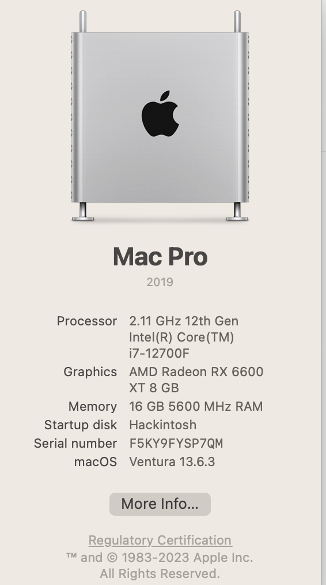
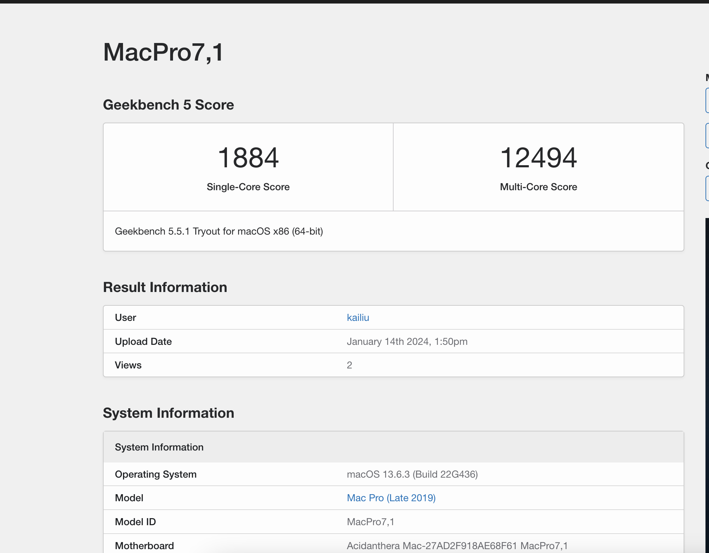
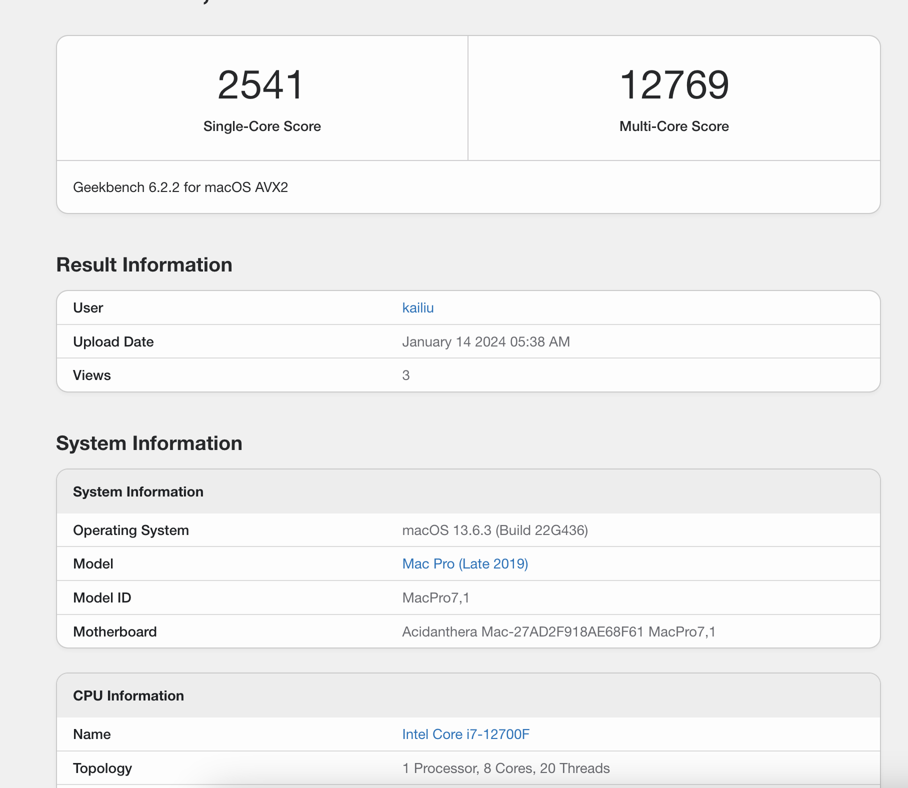
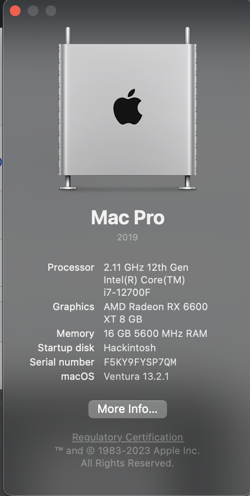
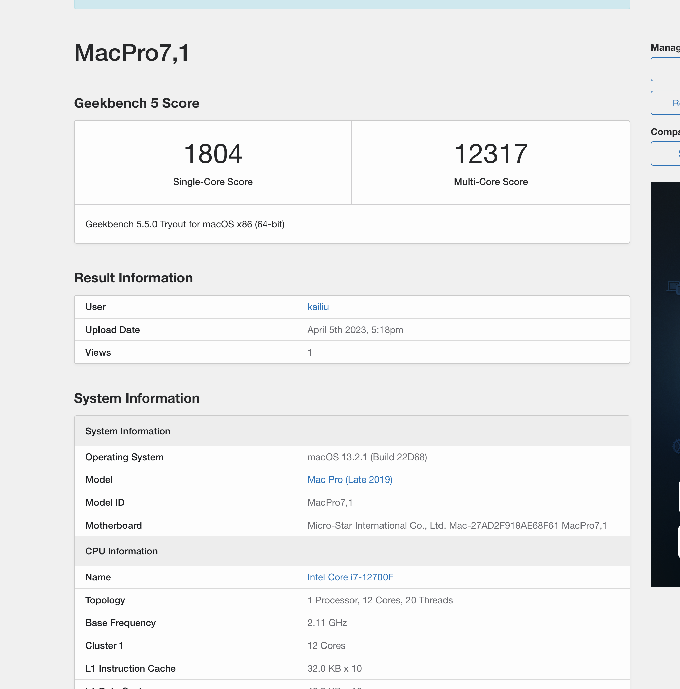
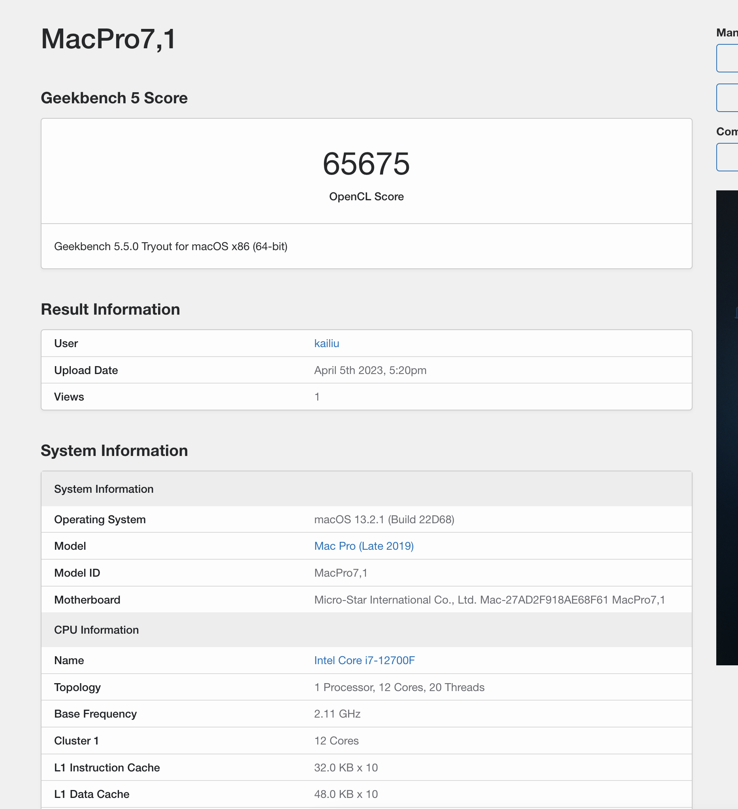
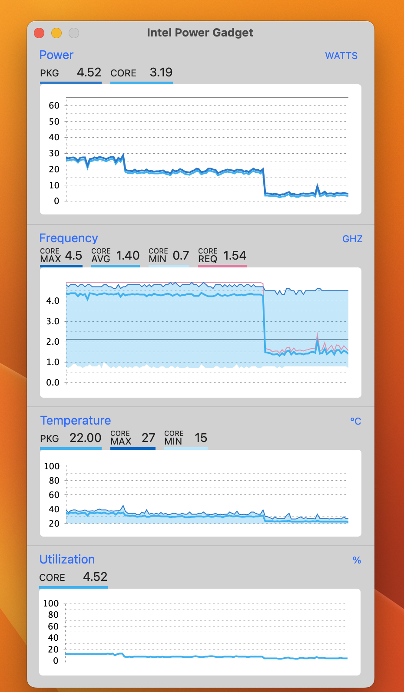
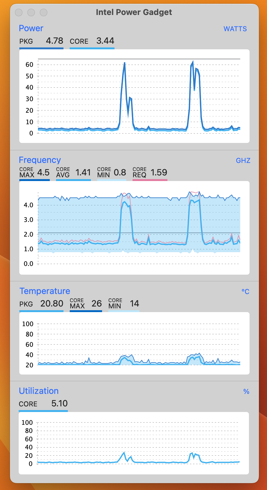

# Hackintosh-i7-12700F-B660-MORTAR-WIFI
## 20240619
[RTC 唤醒处理](https://blog.csdn.net/palmer_kai/article/details/139638326)

## 2024014
应该是最后一次升级黑苹果了，黑苹果的生涯要结束喽

### 参数信息
|Bootloader|	Version	| Boot Mode|	SMBIOS|	macOS|	Version
| :---- | :---- | :---- | :---- | :---- | :---- |
| OpenCore |	0.9.6|	UEFI|	MacPro7,1	| Ventura |	13.6.3	
### 升级信息

1. 升级osx13.6.3 
2. 升级opencore9.6 

### 效果图

所有核心都正常工作

geekbech5 跑分

geekbech6 跑分

## 20230618
1. 升级osx13.4 
2. 升级opencore9.2 
3. 显卡啸叫降频处理 [参考](https://zhuanlan.zhihu.com/p/629023610?utm_id=0
)

## fisrt hackintosh
|Bootloader|	Version	| Boot Mode|	SMBIOS|	macOS|	Version
| :---- | :---- | :---- | :---- | :---- | :---- |
| OpenCore |	0.8.8|	UEFI|	MacPro7,1	| Ventura |	13.2.1	

## 硬件配置

| 名称 | 型号 | 价格(元） |
| :---- | :---- | :---- |
|  CPU  |  i712700F | 0 |
| 主板 | MAG B660M MORTAR WIFI ddr5| 3472 |
| 内存 | 威刚 XPG威龙 5600 白色 ddr5| 582 |
| 硬盘 | 西部数据 SN850X 1T | 869 |
| 显卡 | 蓝宝石 RX6600XT 超白金| 1918.47 |
| 无线网卡 | Fenvi T919 1750M 黑苹果免驱，蓝牙4.0（| 198 |
| 机箱 | 乔思伯 U4 PLUS| 269 |
| cpu风扇 | 利民PA120双塔| 182 |
| 机箱风扇 | 利民TL-C12CW-S 12cm | 15 |
| 电源 | 鑫谷 650W | 369 |

总价：7874.47 ， 去年双十一自己配置的，看了淘宝店家配置下来便宜还送系统，但是硬件品牌不给力。
再加上 trackpad2（800）+ trackpad手垫（188） + nuphy air75（600）这是之前就买来给公司的macbook用的
## BIOS 配置可以参考其他人的

## 相关测试图

